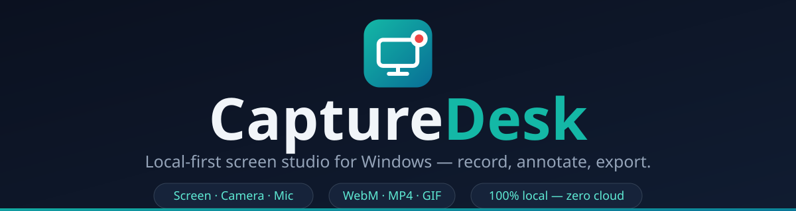

<div align="center">



**Record your screen, camera and mic. Annotate, trim, export.**
**All native. All local. Nothing ever leaves your machine.**

[](../../releases/latest)
[](../../releases/latest)
[](docs/SPEC-NATIVE.md)
[-0D9488?labelColor=0B1120)](desktop-tauri)
[](#privacy-by-design)
[](LICENSE)

### [⬇ Download CaptureDesk v2.0.0](../../releases/latest) &nbsp;·&nbsp; [User guide](docs/USER-GUIDE.md) &nbsp;·&nbsp; [Build from source](docs/BUILDING.md)

</div>

---

## Why CaptureDesk?

Most screen recorders fall into one of two camps: heavyweight Electron apps
that idle at hundreds of megabytes of RAM, or cloud-first tools that want your
footage uploaded to somebody else's servers. CaptureDesk takes a third path —
a **native Windows capture engine** written in C++20 that grabs frames, mixes
audio and encodes video in real time, wrapped in a **lightweight Tauri 2
shell**, with a **Chrome extension** so you can kick off a recording from any
tab without touching the desktop app.

The result is a suite that starts fast, records without stutter, and treats
your recordings like what they are — **your files, on your disk**. The whole
installer is ~24 MB, the runtime footprint is small, and every component is
buildable from the source in this repository. No accounts, no background sync
clients, no phone-home.

| | |
|---|---|
| 🏎️ **Native speed** | Capture + encode in C++20 on Windows.Graphics.Capture, WASAPI and Media Foundation — real-time encoding, no post-render wait |
| 🔒 **Local-first, always** | Recordings, exports, settings and library stay under your user profile. No account, no upload, no telemetry |
| 🎬 **Presentation-ready output** | Click ripples, cursor ring and camera bubble are baked into the capture — demos look rehearsed even when they aren't |
| 🪶 **Small by design** | ~24 MB installer, ~10 MB Tauri shell instead of an embedded browser-in-a-box |

## Feature tour

| | Feature | What you get |
|---|---|---|
| 🖥️ | **Three capture modes** | Full display or single window across every connected monitor, or drag a region on the primary display |
| 🎥 | **Camera bubble** | Picture-in-picture webcam floating over the capture — with a graceful "camera unavailable" state if the camera is busy |
| 🎙️ | **Audio done right** | Microphone and system audio mixed live via WASAPI — together or either one solo |
| 🖱️ | **Click ripples + cursor ring** | Baked into the video itself, so every click is visible without post-production |
| ⏸️ | **Pause & resume** | Step away mid-take; audio stays in sync when you come back |
| ✂️ | **CaptureDesk Editor** | Trim in/out, annotate with pen, highlighter, arrow and rectangle, drop PNG snapshots |
| 📦 | **CaptureDesk Export** | WebM (VP9/VP8 fast stream copy), MP4 (H.264), animated GIF — annotations burned in on export |
| ⌨️ | **Global hotkeys & tray** | Start, pause and stop from anywhere; CaptureDesk lives in the system tray |
| 📚 | **Recordings library** | Thumbnail dashboard over everything you've captured, with quick export and folder picker |
| 🔗 | **Browser-to-desktop bridge** | The Chrome extension drives the desktop app through a native messaging host with a stable extension ID |

Recordings land in `Videos\CaptureDesk` as
`CaptureDesk_YYYY-MM-DD_HH-mm-ss.webm` — timestamped, never overwritten,
always yours.

## Quick start — about 2 minutes

1. **Install the desktop app** — download `CaptureDeskSetup.exe` from the
   [latest release](../../releases/latest) and run it. It's a per-user
   install (no admin rights needed) that sets up the C++ engine, the native
   messaging host and the `capturedesk://` handler. The engine ships with
   FFmpeg statically linked — **no system FFmpeg, no runtime DLLs**.
2. **Load the Chrome extension** — download
   `CaptureDesk-Chrome-Extension.zip`, unzip it (you get a
   `capturedesk-chrome-extension` folder containing `manifest.json`), then
   open `chrome://extensions` → enable *Developer mode* → *Load unpacked* →
   **select that folder**.
3. **Record** — click the CaptureDesk icon in Chrome (or launch the desktop
   app), pick a capture mode, press **Start Recording**.

> 💡 Verify your download with `checksums.txt` (SHA-256) from the same
> release page. If you see "…dll was not found" or a stuck download, you are
> running an **older** installer — uninstall it, re-download the current
> `CaptureDeskSetup.exe`, and confirm its SHA-256 matches `checksums.txt`.
> Windows 10/11 x64; the WebView2 runtime is required and preinstalled on
> updated systems (N editions need the free Media Feature Pack).

## Under the hood

```
  Chrome extension (Manifest V3, JS)
  start / stop / pick source · live status
                   │
                   │  native messaging — length-prefixed JSON over stdio
                   ▼
  Native messaging host (C# / .NET 8, single-file exe)
                   │
                   │  spawn + monitor
                   ▼
  CaptureDesk Desktop (Tauri 2 · Rust shell)
  tray · global hotkeys · settings · recordings library
  region picker · editor · dashboard
                   │
                   │  sidecar process
                   ▼
  CaptureDesk Engine (C++20)
  Windows.Graphics.Capture · WASAPI mix · Media Foundation
  FFmpeg encode → WebM (VP9/VP8) · MP4 (H.264) · GIF
```

Every component uses the language that fits it best:

| Component | Stack | Why |
|---|---|---|
| Desktop shell | **Tauri 2** (Rust) | ~10 MB runtime instead of shipping a whole browser |
| Capture & encode | **C++20** engine | Direct access to Windows.Graphics.Capture, WASAPI and Media Foundation, with FFmpeg doing the encoding |
| Native messaging host | **C# / .NET 8** | Single-file self-contained executable speaking the same wire protocol the extension expects |
| Chrome extension | **JS** (Manifest V3) | The language Chrome itself mandates for extensions |

The full design record — engine protocol, IPC, feature-parity checklist —
lives in [docs/SPEC-NATIVE.md](docs/SPEC-NATIVE.md).

## Privacy by design

- **No cloud, no account, no telemetry.** There is no server component — the
  suite physically cannot phone home with your footage.
- Recordings, exports, thumbnails and settings stay inside your user profile.
- The installer is per-user and requires no admin rights.
- Every release ships SHA-256 checksums, and CI exercises the encode
  pipelines (WebM/MP4/GIF) and the host protocol on every push.

## Build from source

Prerequisites: Windows 10/11, Visual Studio 2022 C++ build tools, Rust
(stable), .NET 8 SDK, Node.js 18+, CMake + Ninja, and FFmpeg 7 development
libraries. Full toolchain details in [docs/BUILDING.md](docs/BUILDING.md).

```bash
# one-shot: engine → host → Tauri app → installer
scripts/release-v2.sh

# or piece by piece
scripts/build-engine.sh      # C++20 engine (CMake + FFmpeg)
scripts/build-host.sh        # C# native messaging host
scripts/build-tauri.sh       # Rust shell + webview UI
scripts/build-installer.sh   # NSIS → CaptureDeskSetup.exe
```

Releases are fully reproducible from CI: pushing a `v2*` tag makes a Windows
runner build the engine, host, shell and installer from a clean tree, then
attach every asset plus SHA-256 checksums to the release automatically.

## Project layout

```
CaptureDesk/
├── extension/         Chrome extension (Manifest V3) — popup, overlay, offscreen, options
├── desktop-tauri/     v2 desktop app
│   ├── src-tauri/     Rust shell — windows, tray, hotkeys, settings, library
│   ├── native/        C++20 engine — WGC capture, WASAPI mix, FFmpeg encode
│   └── ui/            Webview UI + bridge (region picker, editor, dashboard, toolbar)
├── native-host-cs/    C# .NET 8 native messaging host
├── installer/         NSIS script → CaptureDeskSetup.exe
├── scripts/           Build & release pipeline
├── desktop/           v1 Electron app (superseded, kept for reference)
└── docs/              Specs, brand book, building & user guides
```

## Documentation

| Doc | Contents |
|---|---|
| [User guide](docs/USER-GUIDE.md) | Install, record, edit, export — for end users |
| [Building](docs/BUILDING.md) | Toolchains, dependencies, step-by-step builds |
| [Native spec](docs/SPEC-NATIVE.md) | v2 architecture decision record, engine protocol |
| [Desktop spec](docs/SPEC-DESKTOP.md) | Desktop app behaviour & IPC |
| [Extension spec](docs/SPEC-EXTENSION.md) | Extension surface & messaging |
| [Brand book](docs/BRAND.md) | Identity, palette, voice |

## License

MIT — see [LICENSE](LICENSE).
